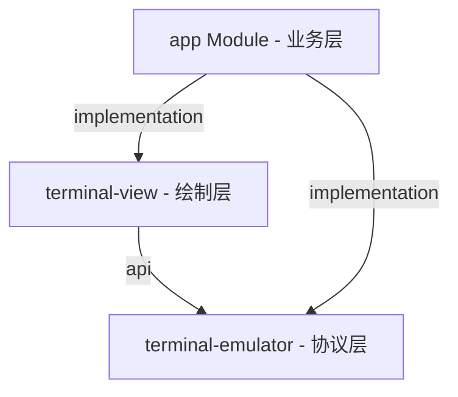

# 📱 WebTerm Android 客户端

> **多端会话聚合大厅** —— 基于 Termux 高性能核心与 WebSocket 的远程终端管理利器。

WebTerm Android 客户端是一个轻量、极致顺滑的远程终端管理器。它成功将 **Termux 原生的高性能终端模拟内核** 与 **远程 Web 终端服务** 进行桥接，旨在为移动端用户提供原汁原味、低延迟、断网防丢包的 SSH/Shell 会话操控体验。

---

## ✨ 核心特性

*   **🖥️ 原生终端渲染**：复用 Termux 的 `terminal-emulator` 和 `terminal-view` 内核，完美支持 VT100/ANSI 逃逸序列解析，提供全字型支持与丝滑的手势缩放。
*   **📡 多设备会话聚合**：支持配置多台远程电脑/服务器，通过 WebSocket 实现双向数据流的高并发、低延迟桥接。
*   **💾 内存-磁盘双级缓存**：
    *   **内存（L1）缓存**：切出终端页面时会话仍驻留在内存中，重入秒开。
    *   **磁盘（L2）缓存**：自动保存会话的历史输出帧，断网或重启时可无缝回放恢复。
*   **✂️ 自动快照截断**：追加缓存帧时若检测到清屏命令（`\u001b[3J\u001b[2J\u001b[H`），将自动清空之前的磁盘帧历史，彻底消除手机磁盘空间无限膨胀的隐患。
*   **⚡ 零阻塞异步加载**：元数据同步与帧 Replay 均在后台线程池异步执行，并进行流式字节合并，彻底消除冷启动假死，实现瞬时黑屏切入、秒级渲染。
*   **🎨 精致的 UI 交互**：内置 8dp 呼吸状态小圆点，并将卡片关闭按钮（✕）重构为右上角绝对定位，提供舒适、精准的移动端交互。

---

## 🏗️ 模块架构

项目采用了清晰的三层渐进式模块化结构，高内聚、低耦合：



1.  **`:terminal-emulator`**：纯 Java/NDK 实现，负责 ANSI 解析、内存行缓冲区，零 UI 依赖，可移植性强。
2.  **`:terminal-view`**：自定义 View，使用 Canvas 负责将缓冲区文本绘制到屏幕，并处理手势。
3.  **`:app`**：整合 WebSocket 远程数据桥接、持久化、双级缓存以及多会话大厅的 UI 构建。

---

## 🛠️ 快速开始

### 1. 构建 Debug/Release 包
在项目根目录下，使用 Gradle 编译生成 APK：
```bash
# 编译 Release 版 APK (会自动使用 debug 证书进行签名)
./gradlew :app:assembleRelease
```
输出包路径：`app/build/outputs/apk/release/app-release.apk`

### 2. 通过 Tailscale 发送到手机 (Taildrop)
若电脑与手机均登录了 Tailscale，可直接使用内置脚本发送安装包：
```bash
./scripts/send.sh <你的手机设备名> app/build/outputs/apk/release/app-release.apk
```
