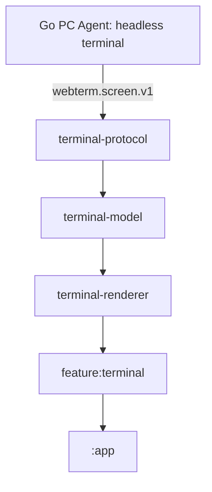

# 📱 WebTerm Android 客户端

> **多端会话聚合大厅** —— 基于 Go 权威终端状态与屏幕协议的远程终端管理器。

WebTerm Android 客户端是一个轻量的远程终端管理器。Go PC Agent 中的无头终端是唯一的 ANSI 解析、滚动历史和光标状态源；Android 只通过 `webterm.screen.v1` 接收权威屏幕投影，并提供输入、选择、复制和本地绘制。

---

## ✨ 核心特性

*   **🖥️ 权威屏幕渲染**：Go Agent 解析 VT/ANSI；Android 以 Canvas 渲染屏幕快照和增量 patch，支持字体、选择、复制、历史按需加载与手势滚动。
*   **📡 多设备会话聚合**：支持配置多台远程电脑/服务器，通过 WebSocket 实现双向数据流的高并发、低延迟桥接。
*   **💾 元数据缓存、状态由服务端恢复**：本地只缓存会话元数据；重新进入终端时由 Go Agent 发送权威快照和历史页，不保存或重放原始 ANSI 字节流。
*   **⚡ 后台模型与背压**：协议解码、模型 patch 应用在后台执行；主线程只消费不可变渲染快照，积压时请求一次权威重同步。
*   **🎨 精致的 UI 交互**：内置 8dp 呼吸状态小圆点，并将卡片关闭按钮（✕）重构为右上角绝对定位，提供舒适、精准的移动端交互。

---

## 🏗️ 模块架构

项目按“权威状态、协议、模型、渲染、业务 UI”分层：



1.  **Go PC Agent**：唯一终端模拟器；负责 PTY、ANSI 解析、屏幕和历史状态。
2.  **`terminal-protocol` / `terminal-model`**：处理 protobuf 屏幕协议、快照、patch、历史分页和本地只读渲染模型。
3.  **`terminal-renderer` / `feature:terminal`**：负责 Canvas 绘制、手势、选择复制、输入和 Android 页面集成。
4.  **`:app`**：整合中继连接、会话大厅与应用级导航。

---

## 🛠️ 快速开始

### 1. 构建 Debug/Release 包
在项目根目录下，使用 Gradle 编译生成 APK：
```bash
# 编译 Release 版 APK (会自动使用 debug 证书进行签名)
./gradlew :app:assembleRelease
```
输出包路径：`app/build/outputs/apk/release/app-release.apk`

### 2. 通过 Tailscale 发送到手机 (Taildrop)
若电脑与手机均登录了 Tailscale，可直接使用内置脚本发送安装包：
```bash
./scripts/send.sh <你的手机设备名> app/build/outputs/apk/release/app-release.apk
```
